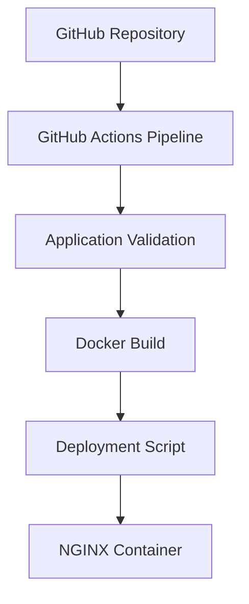

# devops-cicd-pipeline-lab
Automated CI/CD pipeline using GitHub Actions, Docker, and Linux deployment scripting.

## Architecture Diagram

## Technology Stack

- GitHub Actions
- Docker
- Bash
- NGINX
- CI/CD Automation
- Linux Deployment Workflow

  ## Pipeline Workflow

1. Code is pushed to GitHub
2. GitHub Actions validates application files
3. Docker container configuration is checked
4. Deployment script is validated
5. Application is prepared for deployment
